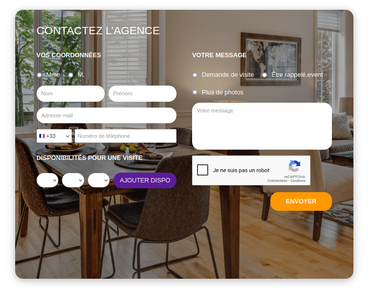
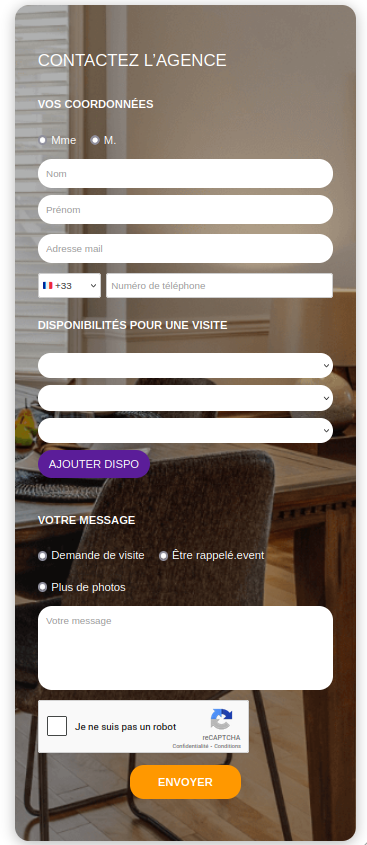

## Présentation

Ce projet est un formulaire de contact web complet.
Il permet à un utilisateur d’envoyer un message à une agence via une interface claire et sécurisée.

## Stack technique

| Côté                 | Technologies                             |
| -------------------- | ---------------------------------------- |
| **Front-end**        | Next.js, TypeScript, React, CSS Modules  |
| **Back-end**         | Node.js, Express.js, Prisma              |
| **Base de données**  | PostgreSQL                               |
| **Sécurité**         | Helmet, express-rate-limit, reCAPTCHA v2 |
| **Conteneurisation** | Docker & Docker Compose                  |

## Screenshots de l'app

### App au format desktop


### App au format tablette



### App au format mobile



## Lancer le projet avec Docker

```bash
docker compose -p majordhom --env-file .env.docker up -d --build
```

Le client sera disponible sur :
[http://localhost:8002](http://localhost:8002)

L’API sera disponible sur :
[http://localhost:3001](http://localhost:3001)

---

Ce projet est disponible en lecture publique à titre démonstratif.  
Aucune réutilisation commerciale, redistribution ou modification du code n’est autorisée sans l’accord préalable de son auteur.  
© 2025 Yann Mottola - Tous droits réservés.
