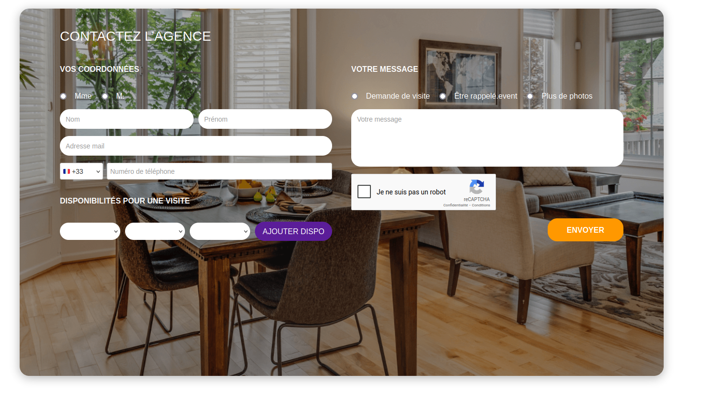

# Rendu à destination de Majordhom

## Présentation

Bienvenue, je m'appelle Yann MOTTOLA, actuellement en fin de formation pour le titre professionnel de concepteur développeur d'application, une certification renseignée au RNCP37873 de niveau 6.

Le stage demandé en fin de formation doit avoir une durée comprise entre 2 et 6 mois.
Je souhaiterais idéalement effectuer un stage d’une durée de 6 mois afin de pouvoir m’investir pleinement dans les projets et consolider mes compétences en conditions réelles.

Ce projet est un formulaire de contact web complet.
Il permet à un utilisateur d’envoyer un message à une agence via une interface claire et sécurisée.

Le formulaire inclut :

* La validation des champs côté client et serveur
* La protection contre les spams via Google reCAPTCHA v2
* Un système de rate limiting pour limiter les requêtes
* L’enregistrement des messages dans une base PostgreSQL
* Une API REST développée avec Express.js
* Une interface front-end en Next.js / React

## Stack technique

| Côté                 | Technologies                             |
| -------------------- | ---------------------------------------- |
| **Front-end**        | Next.js, TypeScript, React, CSS Modules  |
| **Back-end**         | Node.js, Express.js, Prisma              |
| **Base de données**  | PostgreSQL                               |
| **Sécurité**         | Helmet, express-rate-limit, reCAPTCHA v2 |
| **Conteneurisation** | Docker & Docker Compose                  |

## Screenshots de l'app

### App au format desktop



### App au format tablette


### App au format mobile


## Lancer le projet avec Docker

```bash
docker compose -p majordhom --env-file .env.docker up -d --build
```

Le client sera disponible sur :
[http://localhost:8002](http://localhost:8002)

L’API sera disponible sur :
[http://localhost:3001](http://localhost:3001)

---

## Retour d’expérience

### Avez-vous trouvé l'exercice facile ou vous a-t-il posé des difficultés ?

L’exercice m’a demandé un certain temps d’adaptation, notamment pour la configuration de Docker afin de connecter une API à un client.
Durant la formation, nous avions utilisé Docker pour déployer une API, mais nous n’avions qu’effleuré la connexion entre une API et un client.
Je découvrais également React et Next.js à travers ce projet, ce qui a représenté un véritable défi d’apprentissage.

### Avez-vous appris de nouveaux outils pour répondre à l'exercice ? Si oui, lesquels ?

Oui, Google reCAPTCHA et React/Next.js.

### Pourquoi avoir choisi d'utiliser ces outils ?

Pour leur robustesse et leur popularité dans le milieu professionel (React/Next.js + Node.js/Prisma).

### Avez-vous utilisé la stack proposée ? Utilisez-vous régulièrement Docker ?

Non, j’ai mis en place ma propre stack avec Next.js, Express.js et PostgreSQL, des technologies vues pendant ma formation.
Concernant Docker, je l’avais déjà utilisé pour déployer une API, mais ce projet m’a permis de comprendre plus en profondeur la communication entre services (API, client, base de données) via Docker Compose.

---

Ce projet est disponible en lecture publique à titre démonstratif.  
Aucune réutilisation commerciale, redistribution ou modification du code n’est autorisée sans l’accord préalable de son auteur.  
© 2025 Yann Mottola - Tous droits réservés.
